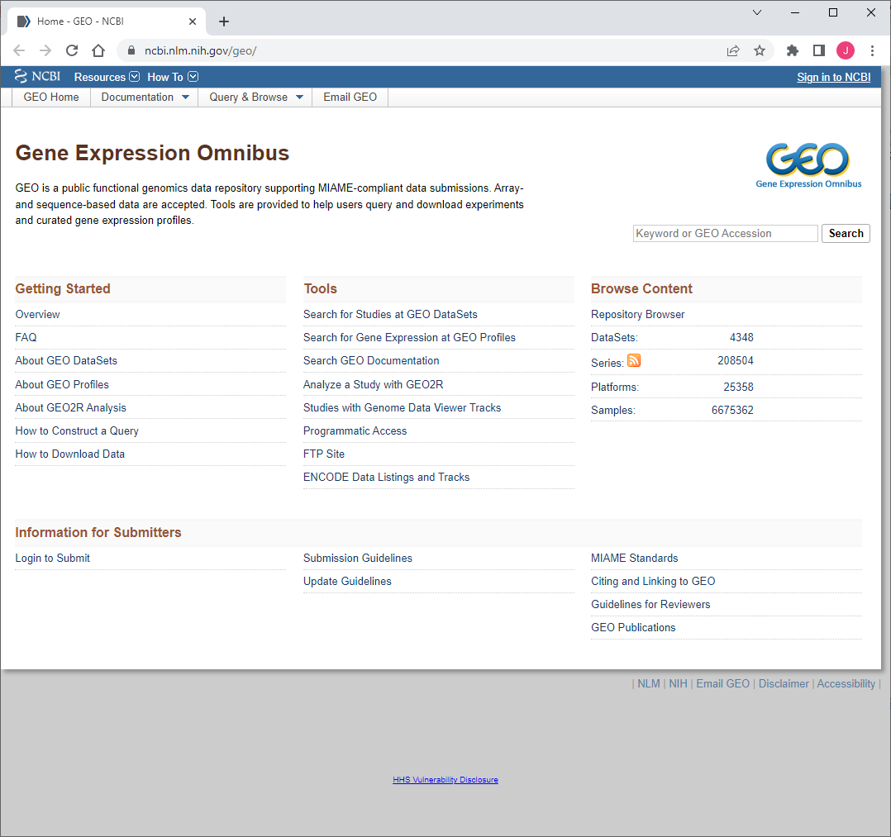
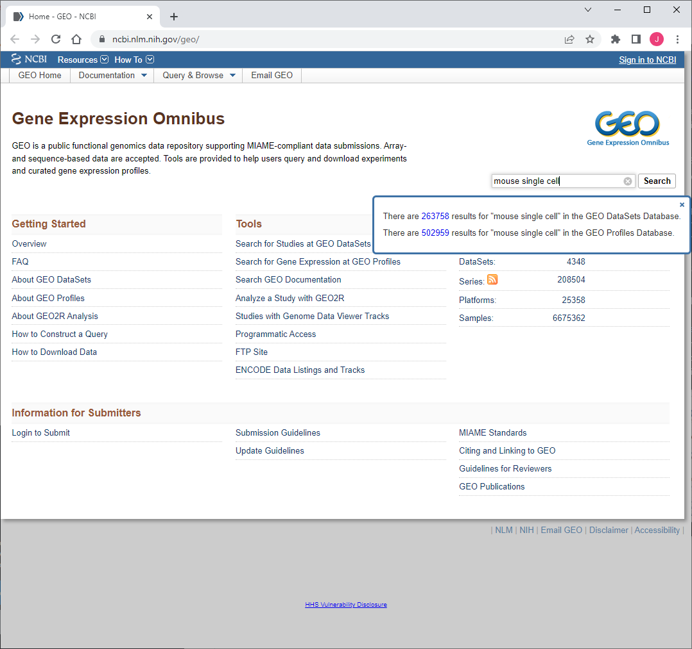
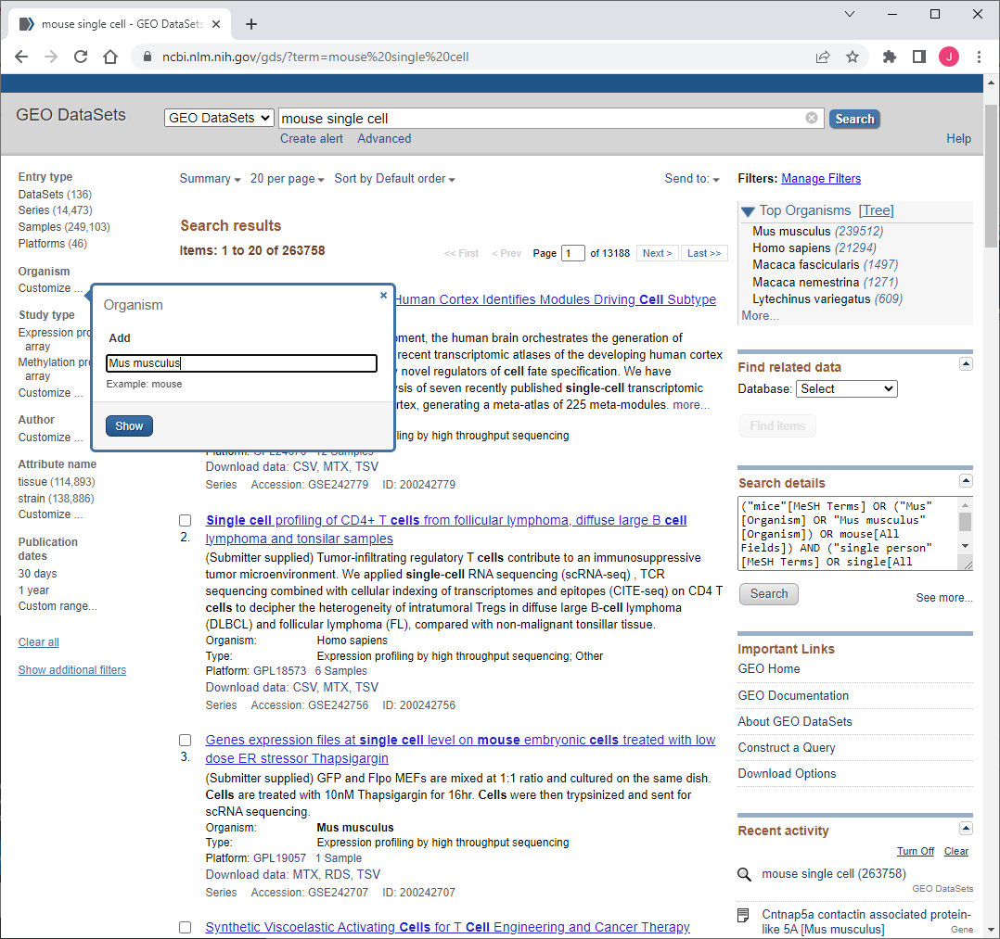
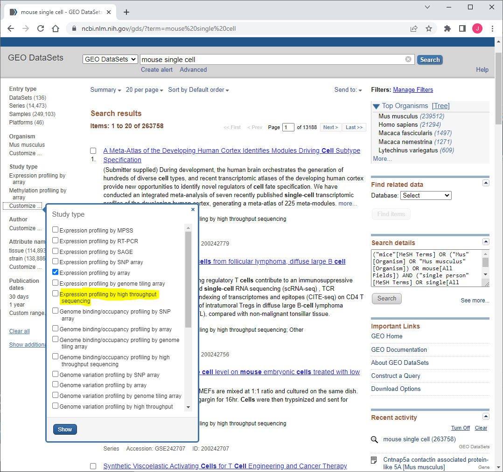

# Mallipattu Lab Pipelines
This repository is used for storing the Pipelines of single cell analysis from the start to the end.  Records pipelines for Single Cell analysis
## HPC

### Seawulf HPC

Seawulf HPC is the high performing computer maintained by Stony Brook University. Please take a look at the [starting guide](https://it.stonybrook.edu/help/kb/getting-started-guide) made by Stony Brook IT department.


### HPC Setup
HPC is installed with a lot of bioinformatic related modules. Instead of managing modules by yourself using ```sudo install``` command, it is better to load the installed module from HPC.

In order to load necessary/commonly used modules during the startup of HPC cluster, editing the .bachrc file will change the startup sequence and load them automatically everytime.

Type ```vim ~/.bashrc``` to edit your bashrc file. Add the following blocks at the end of the file(vim guide: press keyboard ```i``` to enter insert mode):
```
module load R/4.1.1
module load rstudio/2022.07
module load curl/7.52.1
module load geos/3.11.0
module load hdf5/1.10.4
module load gsl/gcc12/2.7.1
module load Bzip2/1.0.8
module load git/2.36.2
module load slurm
module load hts/1.0
```
Press ```Esc``` to quit insert mode and press ```:``` to enter command. Type ```wq``` to write(save the file) and quit vim.

The list above includes most of the analysis tools we need to do analysis. For any other program you want to use, please check it in the cluster command line ```module avial``` to check out whether it is avaliable in the cluster. Use similar fashion to add to your startup bashrc file like the example above. For one time use, just type the module load command in the prompt. It will be unload once you disconnected to HPC.

Some of the bioinformatic packages/modules from later sections comsume a lot of memory. If you are having memory issues, you can always use a different node. Type ```ssh cn-mem``` in the prompt to switch into the node with a higher memory. To switch back, type ```ssh login1```.

## RStudio
There are two methods for using RStudio on HPC. It is recommanded to use RStudio on HPC unless you have a powerful computer with around 60GB of RAM. Seurat consuming a lot of RAM and ArchR only runs on linux-based system, which are the two major analysis tools we are using for single cell analysis. 

### MobaXTerm
The first method would be using MobaXTerm to run RStudio. As we already load R and Rstudio at the start-up, simply type ```rstudio``` in the prompt.

### Slurm
The second method is using slurm file to creat a cluster job to run a server at HPC node. This method needs to write up a slurm file, which you can directly download [here](slurm_files\rstudio_MACS.slurm).

Put this slurm file in your home directory or any directory you want. In that directory, type ```sbatch rstudio_MAC.slurm``` to submit the job. Once the job is finished, a log file will be generated. In order to check the statue of your job, type ```qstat -f XXXXXXX``` in the prompt. ```XXXXXXX``` is the slurm job number. For more information about cluster queue management, please refer to this [link](https://it.stonybrook.edu/help/kb/using-the-slurm-workload-manager) with official guide for Stony Brook Seawulf HPC.

Use ```less rstudio-server.log.XXXXXXXX``` to view the log file. The ```XXXXXXXX``` is your slurm job id, which is assigned as you upload your slurm job. In the file, there is a line starting with `ssh`. Copy the line and paste in your local command line prompt. You local instance will connect to the server. The password is the same as your password for your netid. The connection is successful without further notifications. Otherwise, it will warn you for wrong password or other issues.

Open your browser and type in ```localhost:8003```. If you have a conflict in the port issue, please edit your slurm file with the corresponding line. 8003 is the default setting for this server. Now you can run Rstudio in the browser.


## Gene Expression Omnibus(GEO)
[Gene Expression Omnibus](https://www.ncbi.nlm.nih.gov/geo/) is a database that contains all the bioinformatics projects. Datasets can be acquired through the searching within the website. This website is used for analyzing outside datasets, whether for method crafting or validation.


On the top right of the webpage, there is a search bar. Type in keywords for the datasets. (Potential keywords: Mouse, Single Cell, Kidney.) For this example, we will be looking for mouse single cell dataset.


Click on the upper number with hyperlink for searching in the GEO DataSets Database. 


Now we have 263,758 datasets. In order to filter out the less relavent datasets, we need to set the customizations. 


First click on the Customize on the left panel. Type _Mus musculus_ in the search bar to add mouse to the Organism. 


Then, click on the customize on the study type. Uncheck all the study type and then check the _Expression profiling by high throughput sequencing_.


Click on the new organism and study type we added in the previous steps. Now the number of dataset is reduced to 8601.
### Download Fasta Files to HPC via SRA tools
To use [SRA Tools](https://github.com/ncbi/sra-tools/wiki/Download-On-Demand#downloading-data-on-demand), caching the dataset before downloading is a better practice. Simply use ```prefetch``` to cache the dataset and then use ```fastq-dump``` to download the actuall fastq files.


    prefetch [SRR project]
    fastq-dump [SRR project] --outdir [PATH]
This will download the fastq file into the given path.

## Single Cell Alignment
Fasta/fastq files must be aligned first to do the later downstream analysis. Most of the dataset will be avaliable on the HPC under the group folder(/gpfs/projects/MallipattuGroup). Alignment can be preformed directly on the HPC. The fasta/fastq files are space consuming. It is good practice to copy them into scratch folder first and do alignment there.

## 10X Cell Ranger
### Alignment
There are three different cellranger program: cellranger, cellranger-arc, and cellranger-atac. Cellranger can only align scRNA. Cellranger-atac can only align scATAC. Cellranger-arc is for multiome alignents.

All fastq files needs a naming convention, please click [here](https://support.10xgenomics.com/single-cell-gene-expression/software/pipelines/latest/using/fastq-input) for the official guide on it.

    [Sample Name]_S1_L00[Lane Number]_[Read Type]_001.fastq.gz

Sample Name is your custom name for your sample.
Lane number is normally one digit.
Read type could be R1/R2 for read 1/2, and I1/I2 for index 1/2.

For running the alignment, you can follow this [guide](https://support.10xgenomics.com/single-cell-gene-expression/software/pipelines/latest/using/tutorial_ct) to do the alignment, or simply type ```cellranger count --help``` in the prompt for usage.

[Here](slurm_files/CellRanger.slurm) is an example for Cellranger atac alignment with slurm.

### Mouse Reference Genome
Mouse reference genome is avaliable on the 10X official website. In order to download it on HPC or your local instance, type the following command in the command line:

CellRanger-ARC:

    wget https://cf.10xgenomics.com/supp/cell-arc/refdata-cellranger-arc-mm10-2020-A-2.0.0.tar.gz


CellRanger:

    wget "https://cf.10xgenomics.com/supp/cell-exp/refdata-gex-mm10-2020-A.tar.gz"

### Human Reference Genome

Cellranger-ARC:

    wget https://cf.10xgenomics.com/supp/cell-arc/refdata-cellranger-arc-GRCh38-2020-A-2.0.0.tar.gz

CellRanger:

    wget "https://cf.10xgenomics.com/supp/cell-exp/refdata-gex-GRCh38-2020-A.tar.gz"


It will download the reference file as a gzip file. You may want to unzip it with ```gzip -d file.tar.gz``` and ```tar ```, or you could directly unzip it with ```tar –xvzf documents.tar.gz –C /home/user/destination``` to unzip it to the destination folder.


### Custom Reference Genome
Please refer to the [official guide](https://support.10xgenomics.com/single-cell-gene-expression/software/pipelines/latest/using/tutorial_mr) from 10X Genomics.

## Star/StarSolo

## R Analysis
### ArchR
ArchR is an analytical package for ATAC-seq single cell analysis. It is utilized for a less memory and more efficient way to analysis ATAC-seq single cell data. It also natively support the tajectory analysis. ArchR can handle multiome dataset by itself. However, when ATAC-seq and RNA-seq are analyzed seperately. It is better to first analyze RNA-seq with Seurat and then integrate it to the ATAC component.
#### ArchR analysis with multiome dataset

Please Refer to the [guide](https://greenleaflab.github.io/ArchR_2020/Ex-Analyze-Multiome.html) by Greenleaf Lab.

#### ArchR analysis with ATAC-seq and RNA-seq dataset
Please use the ArchR [Manual](https://www.archrproject.com/bookdown/index.html) for ATAC-seq analysis. However, for RNA integration, please look into next section using Seurat to analysis first.

### Seurat
Seurat is a single cell analysis package for RNA-seq only. However, from the same labatory, Signac is developed to analysis ATAC-seq data based on the Seurat Objects.

#### Seurat RNA single cell analysis

#### Signac ATAC analysis

### Pathway Analysis
Pathway analysis is done throught the pathview,clusterProfiler ,and ChIPseeker. 
#### GSEA Analysis 